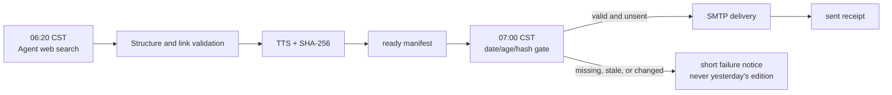

# Academic Dispatch, with Detours

An agent-first academic briefing that searches the open web, validates sources, seals an auditable dispatch at 06:20 China Standard Time, and delivers Markdown plus Chinese TTS at 07:00 only after rechecking artifact hashes.

[中文](README.md) · [Sample](examples/sample-dispatch.md) · [Configuration](docs/CONFIGURATION.md) · [Deployment](docs/DEPLOYMENT.md) · [Operations](docs/OPERATIONS.md)

It is for readers who want papers, open-source releases, and official technical updates without maintaining a fragile chain of search, summarization, speech, and email scripts. A web-capable agent makes editorial decisions; deterministic programs validate, synthesize, deliver exactly once, and retain evidence.



## Quick Start

Python 3.9+ is supported; 3.12 is recommended.

```powershell
git clone https://github.com/zh3zhou/newpapers-boy.git
cd newpapers-boy
.\setup.ps1
.\.venv\Scripts\python.exe scripts\project_doctor.py --target manual
```

Edit `dispatch.config.json`, add SMTP credentials to the untracked `.env`, then ask a web-search-capable agent:

```text
Read AGENTS.md and dispatch.config.json, generate today's real dispatch,
and run scripts/finalize_dispatch.py. Do not send email.
```

At delivery time:

```powershell
.\.venv\Scripts\python.exe scripts\deliver_ready.py 2026-07-24
```

Use `sh setup.sh` and `.venv/bin/python` on Linux/macOS.

## Delivery guarantees

- `dispatch.config.json` is the canonical machine configuration. Legacy `config.md` parsing remains for one release with a migration warning.
- Effective priority is CLI → allowed environment override → JSON → safe built-in default. Secrets remain in `.env` or GitHub Secrets.
- Finalization validates structure, history, source diversity, and link verdicts before writing an atomic ready manifest.
- Delivery verifies date, freshness, size, and SHA-256, and refuses duplicate sends unless `--force` is explicit.
- A missing, expired, or modified artifact triggers a short attachment-free failure notice. Old content is never substituted.
- Structured JSONL events and sent receipts retain operational evidence without storing recipients, message bodies, passwords, or tokens.

GitHub and desktop scheduling both use explicit UTC times: 22:20 UTC for preparation and 23:00 UTC for delivery. GitHub schedules remain disabled by default.

## Verification

```powershell
.\.venv\Scripts\python.exe scripts\validate_config.py
.\.venv\Scripts\python.exe -m unittest discover -s tests -v
.\.venv\Scripts\python.exe scripts\project_doctor.py --target manual --json
git diff --check
```

Tests demonstrate the delivery contract and failure gates. They do not prove long-term punctuality; that claim requires accumulating real production events and receipts.

See the [technical report](TECH_REPORT.md), [security policy](SECURITY.md), [contribution guide](CONTRIBUTING.md), and [v0.1.0 notes](docs/releases/v0.1.0.md). MIT licensed.
