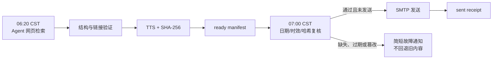

# 会打岔的学术速递

每天用 Agent 做广域网页检索与来源校验，在北京时间 06:20 封存一份可审计的学术速递，07:00 复核哈希后发送 Markdown 与中文 TTS。学术之外，默认穿插 5 条来自至少 3 个独立来源的艺术内容。

[English](README.en.md) · [示例速递](examples/sample-dispatch.md) · [配置](docs/CONFIGURATION.md) · [部署](docs/DEPLOYMENT.md) · [运维](docs/OPERATIONS.md)

适合希望持续跟踪论文、开源项目和官方技术发布，又不想把搜索、摘要、朗读和准点邮件拼成一堆脆弱脚本的人。内容判断由可联网 Agent 完成；验证、TTS、幂等发送和证据留存由确定性程序完成。

> 示例结果：一封包含分领域中文摘要、原始链接、推荐理由、跨机构艺术岔题和 MP3 播报的邮件。公开示例已移除收件人、运行日志和本地路径。



## Quick Start

需要 Python 3.9+；推荐 3.12。

```powershell
git clone https://github.com/zh3zhou/newpapers-boy.git
cd newpapers-boy
.\setup.ps1
.\.venv\Scripts\python.exe scripts\project_doctor.py --target manual
```

然后：

1. 编辑 `dispatch.config.json`，调整领域和数量。
2. 将 `.env.example` 复制得到的 `.env` 填入 SMTP 配置；不要把密码发到对话中。
3. 对具备网页搜索和文件能力的 Agent 说：

```text
请读取 AGENTS.md 和 dispatch.config.json，为今天生成真实速递，
然后运行 scripts/finalize_dispatch.py；不要发送邮件。
```

4. 到发送时运行：

```powershell
.\.venv\Scripts\python.exe scripts\deliver_ready.py 2026-07-24
```

Linux/macOS 使用 `sh setup.sh` 和 `.venv/bin/python`。

## 稳定交付契约

- `dispatch.config.json` 是唯一机器配置真源；`config.md` 仅保留一个版本的迁移兼容。
- 配置优先级：CLI → 允许的环境覆盖 → JSON → 安全默认值。秘密只放 `.env` 或 GitHub Secrets。
- `finalize_dispatch.py` 严格检查结构、历史重复、来源多样性与链接状态，生成 TTS 后原子写入 `*_ready.json`。
- `deliver_ready.py` 复核日期、过期时间、文件大小和 SHA-256。默认禁止重复发送；只有显式 `--force` 可重发。
- ready 缺失、过期或损坏时，不发送昨日内容，只发无附件的故障通知并返回失败。
- `data/runs.jsonl` 记录阶段、耗时所需证据、哈希和 Message-ID，不记录邮件地址、正文、密码或 Token。

链接判定分为 `reachable`、`bot_blocked`、`dead`、`unsafe` 和 `transient`。HTTP 403 会被如实标为机器人阻断，不再宣称“已确认可达”。

## 自动运行

桌面生产路线使用两个独立任务：

- 22:20 UTC / 06:20 北京时间：准备速递，只生成 ready artifact。
- 23:00 UTC / 07:00 北京时间：确定性交付，只验证并发送。

GitHub Actions 同样拆为 `prepare-dispatch.yml` 和 `deliver-dispatch.yml`。默认 `DISPATCH_ENABLED=false`；prepare 不接触 SMTP，deliver 只接受默认分支同日期的成功 artifact。详见[部署指南](docs/DEPLOYMENT.md)。

## 验证

```powershell
.\.venv\Scripts\python.exe scripts\validate_config.py
.\.venv\Scripts\python.exe -m unittest discover -s tests -v
.\.venv\Scripts\python.exe scripts\project_doctor.py --target manual --json
git diff --check
```

代码和测试能证明交付链路、幂等门禁与失败路径；“长期准点”必须由后续真实 `runs.jsonl` 和发送收据持续验证，不能由一次测试替代。

## 文档

- [配置字段与迁移](docs/CONFIGURATION.md)
- [桌面与 GitHub 部署](docs/DEPLOYMENT.md)
- [运行、故障处理与证据](docs/OPERATIONS.md)
- [技术报告](TECH_REPORT.md)
- [安全策略](SECURITY.md)
- [贡献指南](CONTRIBUTING.md)
- [v0.1.0 发布说明](docs/releases/v0.1.0.md)

MIT License。
